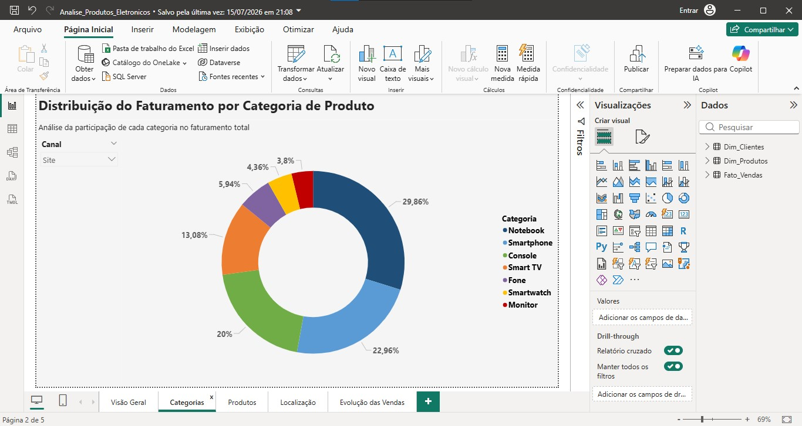
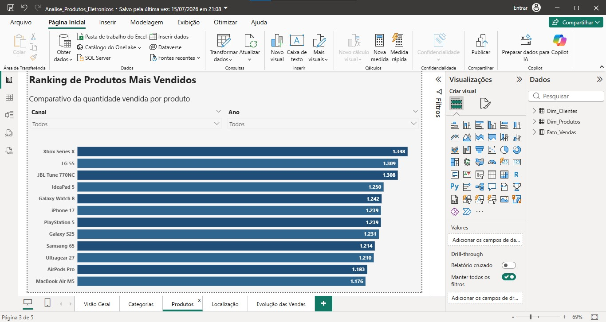

# 📊 Análise de Produtos Eletrônicos

## 📖 Sobre o projeto

Este projeto foi desenvolvido em Power BI utilizando uma base fictícia de vendas de produtos eletrônicos.

O que começou como um exercício de matriz virou meu primeiro projeto completo de análise de dados. A partir dos dados disponíveis, defini 5 perguntas de negócio que queria responder — e construí uma página do dashboard para cada uma delas.

O objetivo é demonstrar conhecimentos em modelagem de dados, Power Query, DAX e criação de dashboards para apoio à tomada de decisão.

---

## 🛠️ Ferramentas utilizadas

- Power BI
- Power Query
- DAX
- Microsoft Excel

---

## ❓ Perguntas do projeto

### 1. Como está distribuído o faturamento entre os canais de venda?

A página **Visão Geral** compara os três canais de venda (Site, Marketplace e Loja Física) em quantidade, desconto e valor total, permitindo identificar rapidamente qual canal mais contribui para o faturamento.

---

### 2. Qual categoria representa a maior parcela das vendas?

A página **Categorias** traz a distribuição percentual do faturamento por categoria de produto (Notebook, Smartphone, Console, Smart TV, Fone, Smartwatch e Monitor), com filtro por canal de venda.

---

### 3. Quais são os produtos mais vendidos?

A página **Produtos** apresenta um ranking dos itens com maior quantidade vendida, com filtros por canal e ano.

---

### 4. Quais cidades concentram o maior faturamento?

A página **Localização** exibe a distribuição geográfica do faturamento em um mapa, destacando as cidades com maior concentração de vendas.

---

### 5. Como as vendas evoluíram ao longo do tempo?

A página **Evolução das Vendas** mostra a série temporal do faturamento, com linha de tendência para identificar o comportamento das vendas ao longo dos períodos.

---

## 📈 Indicadores desenvolvidos

- Faturamento total
- Quantidade de vendas
- Produtos mais vendidos
- Faturamento por categoria
- Distribuição geográfica das vendas
- Evolução do faturamento

---

## 🎯 Objetivo

Desenvolver um dashboard interativo para análise de vendas, permitindo identificar tendências e apoiar decisões baseadas em dados.

---

## 👨‍💻 Autor

Lucas Oliveira
