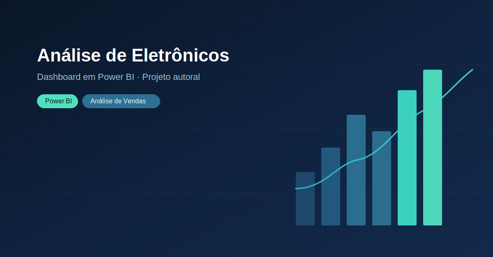
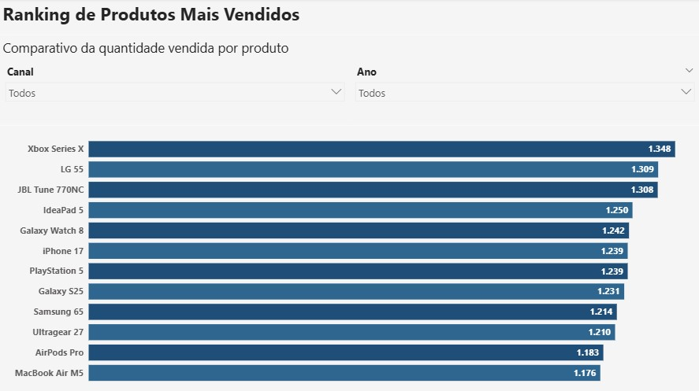
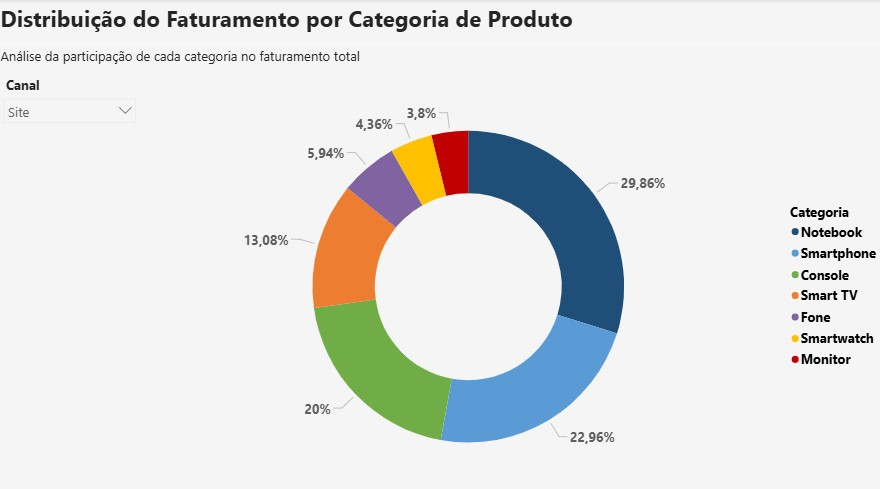

# 📊 Análise de Produtos Eletrônicos — Power BI

  

## 📌 Sobre o projeto

Este projeto apresenta uma análise de vendas de produtos eletrônicos desenvolvida no **Power BI**, com foco na identificação de padrões de vendas, desempenho dos produtos, evolução ao longo do tempo e distribuição geográfica das vendas.

O dashboard foi desenvolvido buscando transformar os dados em informações que possam apoiar a análise de desempenho e a tomada de decisão.

## 🎯 Objetivos

* Analisar o desempenho das vendas ao longo do tempo;
* Identificar as categorias e produtos com maior participação nas vendas;
* Comparar o desempenho dos produtos;
* Analisar a distribuição das vendas por localização;
* Criar indicadores para acompanhamento dos principais resultados;
* Desenvolver uma visualização clara e interativa para exploração dos dados.

## 🛠️ Ferramentas utilizadas

* **Power BI**
* **Power Query**
* **DAX**
* Modelagem de dados
* Relacionamentos entre tabelas
* Visualização e criação de dashboards

## 📊 Dashboard

O projeto foi estruturado em diferentes páginas para facilitar a análise dos dados.

### Visão Geral

Página destinada ao acompanhamento dos principais indicadores e uma visão consolidada do desempenho das vendas.

### Evolução de Vendas

Análise da evolução das vendas ao longo do período, permitindo identificar tendências e variações no desempenho.

### Produtos

Análise do desempenho dos produtos, permitindo identificar os itens com maior participação nas vendas.

### Categorias

Comparação do desempenho entre as diferentes categorias de produtos.

### Localização

Análise da distribuição das vendas de acordo com a localização.

